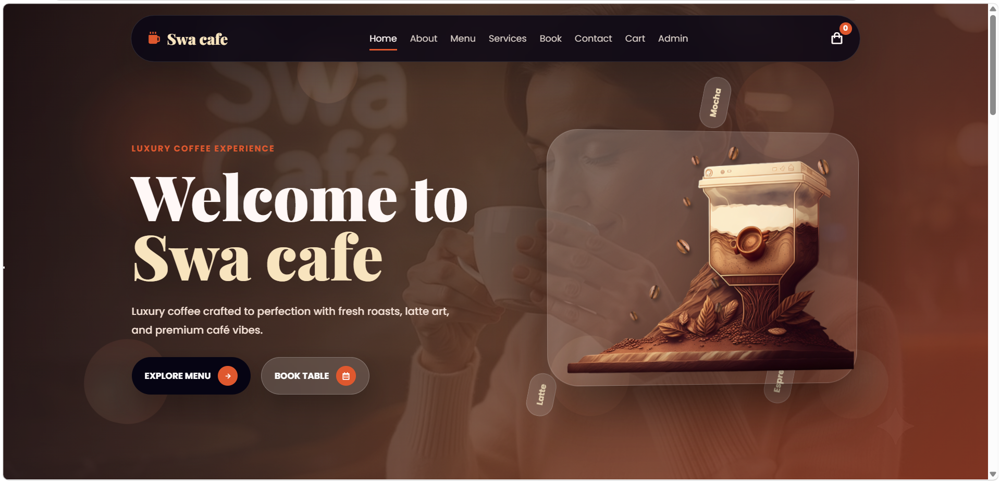
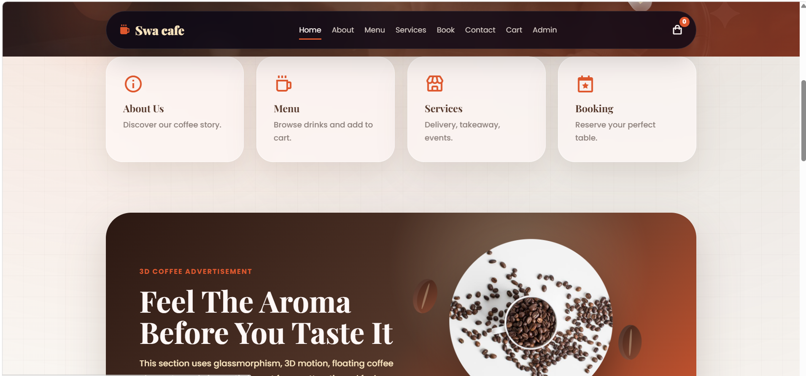
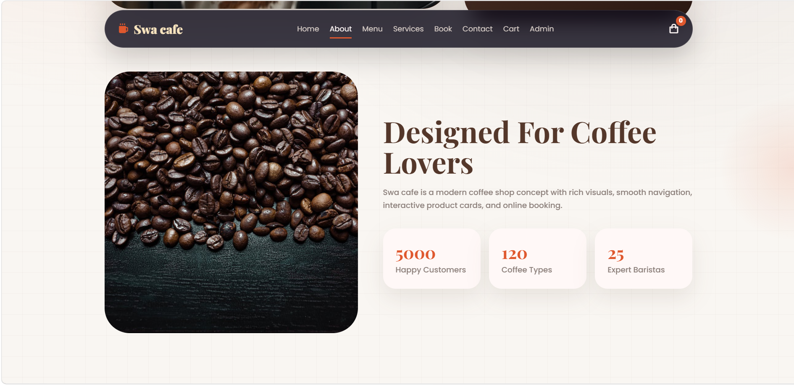
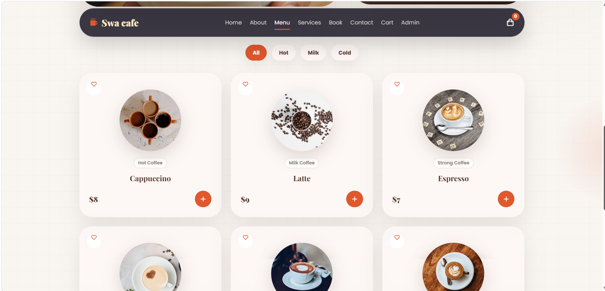
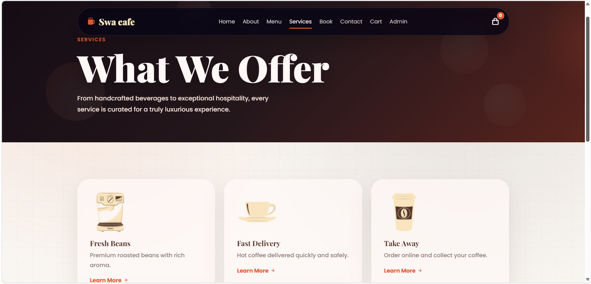
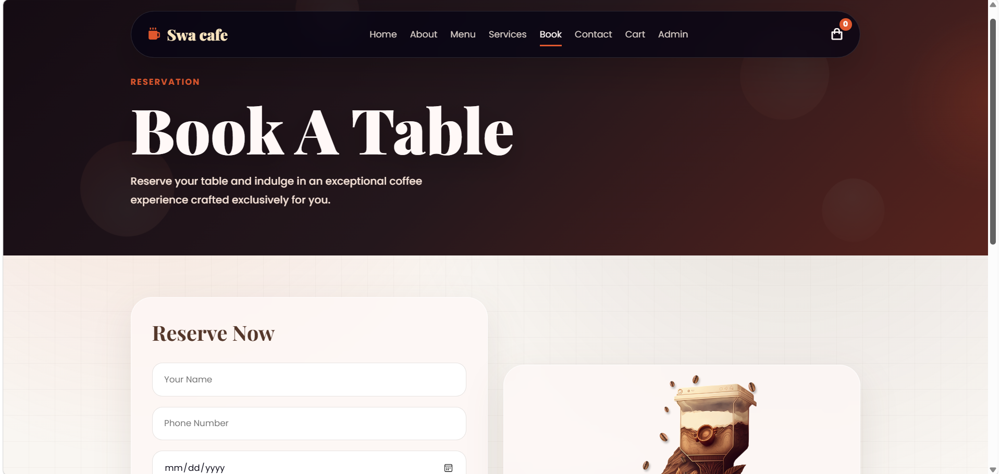
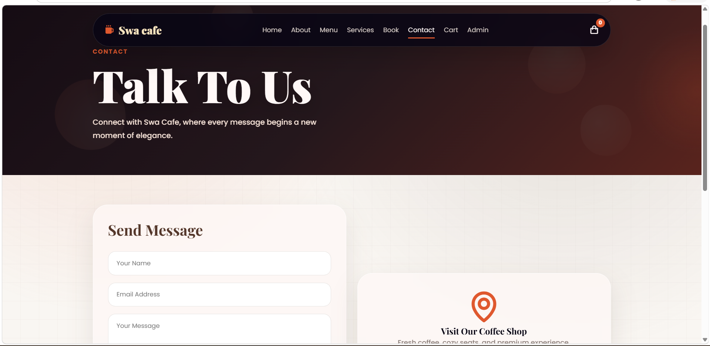
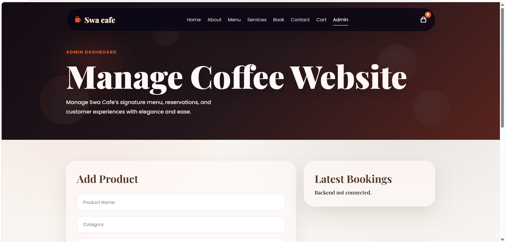

# ☕ Brew3D Coffee Commerce Platform

## 🌐 Live Demo

🚀 **[View Swa Cafe Live Website](https://swa-cafe-commerce.netlify.app/)**

A full-stack, multi-page coffee commerce website with an interactive 3D-inspired frontend and a Node.js, Express, and MongoDB backend.

The project includes product browsing, booking, cart, contact, admin, and service pages, with a responsive visual design and animated coffee-themed experience.

---

## 🚀 Project Overview

**Brew3D Coffee Commerce Platform** is a full-stack web application designed to simulate a modern coffee shop experience online.

The platform combines a visually engaging frontend with backend functionality for managing coffee-related business operations.

The project demonstrates:

- Frontend development
- Responsive web design
- JavaScript interaction
- REST-style backend development
- MongoDB integration
- Express.js API development
- Full-stack project structure

---

## ✨ Features

- ☕ Interactive coffee-themed landing page
- 🛍️ Coffee menu and product browsing
- 🛒 Shopping cart interface
- 📅 Table / service booking page
- 📩 Contact form
- 🧾 Services section
- 👩‍💼 Admin page
- 📱 Responsive multi-page design
- 🎞️ Animated / 3D-inspired visual experience
- 🌐 Node.js + Express backend
- 🗄️ MongoDB database integration
- 🔐 Environment-variable configuration
- 🔄 CORS-enabled backend API

---

## 🖥️ Website Pages

The application contains the following main pages:

```text
index.html
about.html
menu.html
services.html
booking.html
cart.html
contact.html
admin.html
```

---

## 📸 Project Screenshots

### 🏠 Home Page


### ✨ Home Features


### ☕ About Swa Cafe


### 📋 Coffee Menu


### 🚚 Services


### 📅 Table Booking


### 📩 Contact Page


---


### 👩‍💼 Admin Dashboard
